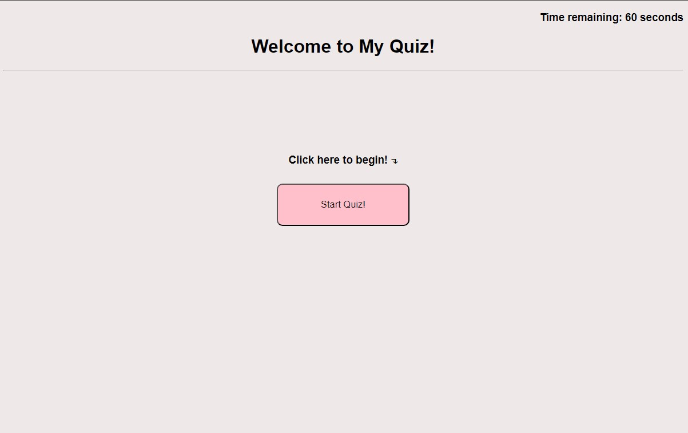

# Coding Quiz

## Description
The purpose of this project was to create a quiz with JavaScript, html, and css. The application must be able to track time, subtract time when a questions is answered wrong, track score, and display the previous highscores.

## Screenshot

## Website
Link to website below:
https://kaylommy.github.io/kaylommy-module-4-challenge/